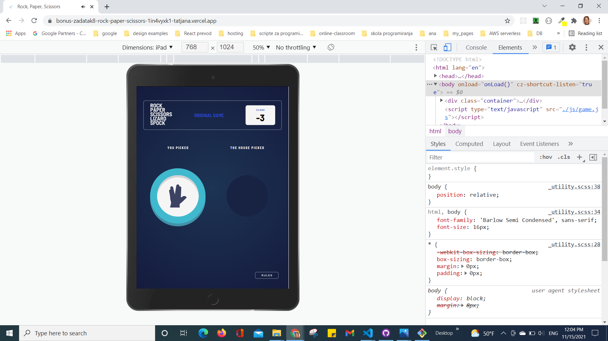

# Tatjana Marković # Rock, Paper, Scissors

## Table of contents

  - [Overview](#overview)
  - [The challenge](#the-challenge)
  - [Screenshot](#screenshot)
  - [Links](#links)
  - [My process](#my-process)
  - [Built with](#built-with)
  - [Author](#author)

## Overview

User can switch between different versions of the game by clicking button on the header:
- original game
- or bonus game.
### Rules

If the player wins, they gain 1 point. If the computer wins, the player loses one point.

#### Original

- Paper beats Rock
- Rock beats Scissors
- Scissors beats Paper

#### Bonus

- Scissors beats Paper
- Paper beats Rock
- Rock beats Lizard
- Lizard beats Spock
- Spock beats Scissors
- Scissors beats Lizard
- Paper beats Spock
- Rock beats Scissors
- Lizard beats Paper
- Spock beats Rock

Not sure what Rock, Paper, Scissors, Lizard, Spock is? [Check out this clip from The Big Bang Theory](https://www.youtube.com/watch?v=iSHPVCBsnLw).
## The challenge

Your challenge is to build out this Rock, Paper, Scissors game and get it looking as close to the design as possible.

Your users should be able to:

- View the optimal layout for the game depending on their device's screen size
- Play Rock, Paper, Scissors against the computer
- Maintain the state of the score after refreshing the browser _(optional)_
- **Bonus**: Play Rock, Paper, Scissors, Lizard, Spock against the computer _(optional)_
### Screenshot

### Links

- Solution URL: [GitHub](https://github.com/tatjama/bonus-zadatak8-rock-paper-scissors/tree/develop)
- Preview: [Vercel](https://vercel.com/tatjana/bonus-zadatak8-rock-paper-scissors/61A2SGYkbLUhWJht5jCVGPmAUxXB)
- Live Site URL: [Vercel](https://bonus-zadatak8-rock-paper-scissors.vercel.app/)

## My process

1. Create a new project
2. Initializing git repositories main and develop
3. Import git repositories to the Vercel project
4. Create HTML structure
5. Create SCSS Utility
6. Style for Desktop
7. Create JavaScript  for game original
8. Create JavaScript for game bonus
9. Responsive Mobile
10. Responsive Tablet Style
11. Manual Test for bugs
12. Create screenshots
13. Change README-template.md to README.md
14. Open Pull request
15. Solve Issue
16. Merge develop branch into master branch
### Built with

1. Semantic HTML5 markup
2. Sass Styling custom properties
- FlexBox
- Media queries
- Centering elements, content and text
- Element positioning
- Customize font,width and size
- Hover
- CSS variables
- gradient
- Animation
3. SASS
- variables 
- functions 
- imports
4. JavaScript
- DOM manipulation   
- Event handling
- Local Storage
- Audio
## Author

- Website - [Tatjana Markovic](https://my-react-portfolio-tatjana.vercel.app/)
- LinkedIn - [Tatjana Marković](https://www.linkedin.com/in/tatjana-markovi%C4%87-919501189/)
- GitHub - [tatjama](https://github.com/tatjama)